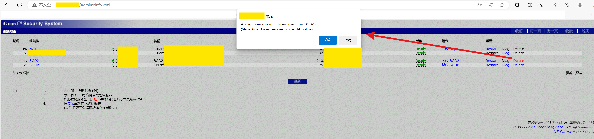
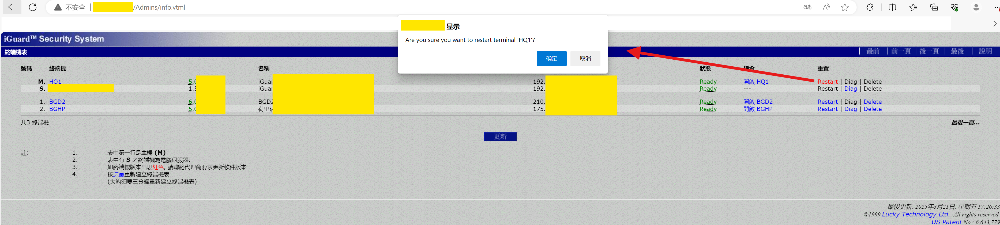

# The iGuard attendance management system has an unverified access control vulnerability

Lucky Technology Ltd's attendance machine equipment has unauthorized access control vulnerabilities, allowing attackers to remotely shut down, reset, and delete attendance machines, obtain personnel information from various departments of the target company, and download user attendance records.

Vulnerable targets include but are not limited to software version 5.0.9433A of LM-520-SC.

